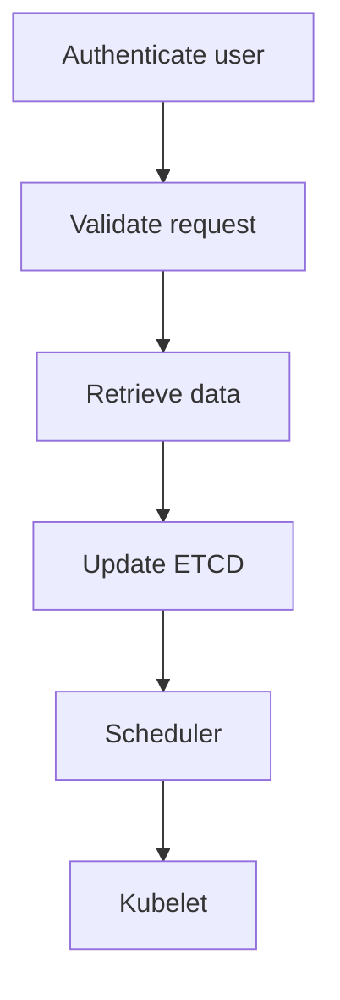

Kubernetes (a.k.a k8s) is a container orchestrator, for automating deployment, management and scaling of applications.

# Cluster architecture main components

+ **Master nodes**
    + **kube-apiserver**: Responsible for orchestration. Main service.
    + **etcd**: Highly available key/value store.
    + **kube-scheduler**: Identify the right worker node to put a pod.
    + **controller-manager**: Continuously monitor the states of various components
    + **node-controller**: Take care of nodes. Node availability, destroy, number of container, etc.
    + **replication-controller**: Helps run multiple instances of a pod in a single k8s cluster.

+ **Worker nodes**
    + **kubelet**: listen for instructions from the API server.
    + **kube-proxy**: ensure necessary rules are in place for the containers in other nodes to communicate.
    + **container runtime environment**: containerd, docker, rkt, etc.

# Kube-API server

Is the primary management component in kubernetes. Command `kubectl` reaches the cluster through the API server. And kube-API server is the only component who interact directly with ETCd datastore. The other components do it using the Kube-API server.

+ API call workflow pattern:


If cluster has been deployed with kubeadm the API configuration options are defined in: `/etc/kubernetes/manifests/kube-apiserver.yaml`.

If cluster has been deployed from scratch the options are located: `/etc/systemd/system/kube-apiserver.service`.

To check the Kube-API server process in a cluster node run:

```
    $ ps -aux | grep kube-apiserver
```

# ETCd

ETCd is one of the main components of a k8s cluster. Is a distributed reliable key-value store. And it stores information about the cluster such as:
  + Nodes
  + PODs
  + Secrets
  + Accounts
  + Roles
  + Bindings
  + Others

Basically all information provided by `kubectl` comes from `etcd``**.

+ Runs on port **2379**.

+ `./etcdctl` is the CLI tool to store and retrive key/value pairs. For example:

```
     $ etcdctl get / --prfix -keys-only
```

+ Etcd api version 2:
```
$ etcdctl backup
$ etcdctl cluster-health
$ etcdctl mk
$ etcdctl mkdir
$ etcdctl set
```

+ Etcd api version 3:
```
$ etcdctl snapshot save
$ etcdctl endpoint health
$ etcdctl get
$ etcdctl put
```

+ To set the right API version set (default v2):
```
$ export ETCDCTL_API=3
```

+ Etcdctl certificates to authetincate with the etcd api server:
```
     --cacert /etc/kubernetes/pki/etcd/ca.crt
     --cert /etc/kubernetes/pki/etcd/server.crt
     --key /etc/kubernetes/pki/etcd/server.key
```

+ kubectl command:
```
     $ kubectl exec etcd-master -n kube-system -- sh -c "ETCDCTL_API=3 etcdctl get / --prefix --keys-only --limit=10 --cacert /etc/kubernetes/pki/etcd/ca.crt --cert /etc/kubernetes/pki/etcd/server.crt  --key /etc/kubernetes/pki/etcd/server.key"
```

# Kube controller manager

Processes that continuously monitor the states of various components, and works towards bringing the whole system to a desired function state. 

Some controllers are:

+ node-controller: monitor the state of the node and takes necesary actions to keep aplication running.
   + Node monitor period = 5s
   + Node monitor grace period = 40s
   + POD Eviction timeout = 5m (after 5m node down remove the pods assigned to the node)

+ replication-controller: Monitoring the state of replica set and ensuring the desired number of pods are available. If pod dies it create a new one.

+ Other controllers:
   + deployment-controller
   + namespace-controller
   + endpoint-controller
   + job-controller


To view the controller-manager configuration:
   + For cluster deployed with kubeadm as a pod, the configuration is located at `/etc/kubernetes/manifests/kube-controller-manager.yaml`
   + In a none kubeadmin setup, is located at `/etc/systemd/system/kube-controller-manager.service`.

+ To check the running process in a cluster use the command `$ ps -aux | grep kube-controller-manager`.

# Kube scheduler

Service responsible for scheduling PODs on nodes. It filter and rank nodes to decide where to run a POD.
Answer to question: which POD run in each node?

To view the scheduler configuration when cluster deployed with kubeadm, check file `/etc/kubernetes/manifests/kube-scheduler.yaml`
